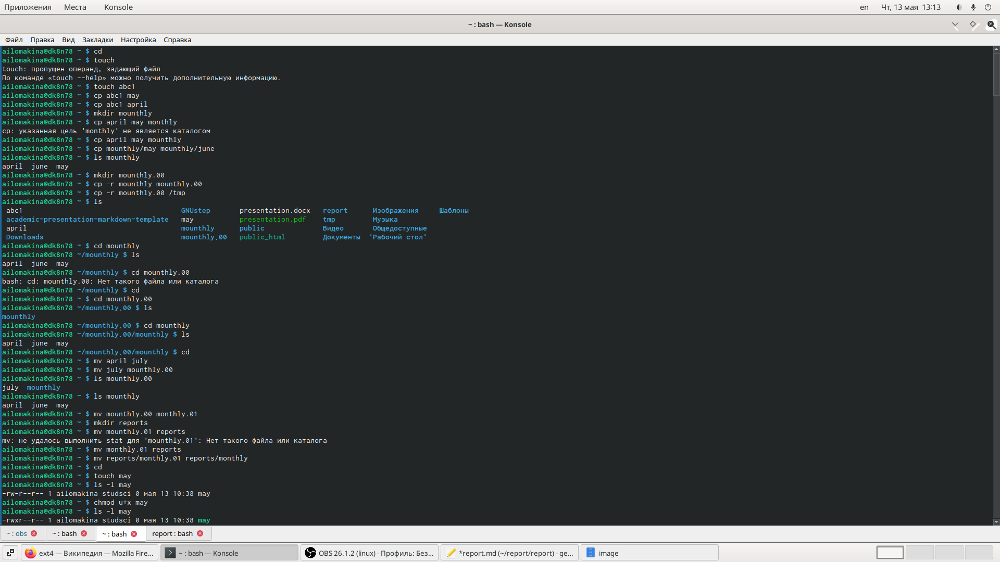

---
# Анализ файловой системы Linux.Команды для работы с файлами и каталогами
lang: ru-RU
title: "Отчёт по лабораторной работе №6"
subtitle: "Анализ файловой системы Linux.Команды для работы с файлами и каталогами"
author: "Ломакина Анна Ивановна"

# Formatting
toc-title: "Содержание"
toc: true # Table of contents
toc_depth: 1
lof: true # List of figures
lot: true # List of tables
fontsize: 12pt
linestretch: 1.5
papersize: a4paper
documentclass: scrreprt
polyglossia-lang: russian
polyglossia-otherlangs: english
mainfont: PT Serif
romanfont: PT Serif
sansfont: PT Sans
monofont: PT Mono
mainfontoptions: Ligatures=TeX
romanfontoptions: Ligatures=TeX
sansfontoptions: Ligatures=TeX,Scale=MatchLowercase
monofontoptions: Scale=MatchLowercase
indent: true
pdf-engine: lualatex
header-includes:
  - \linepenalty=10 # the penalty added to the badness of each line within a paragraph (no associated penalty node) Increasing the value makes tex try to have fewer lines in the paragraph.
  - \interlinepenalty=0 # value of the penalty (node) added after each line of a paragraph.
  - \hyphenpenalty=50 # the penalty for line breaking at an automatically inserted hyphen
  - \exhyphenpenalty=50 # the penalty for line breaking at an explicit hyphen
  - \binoppenalty=700 # the penalty for breaking a line at a binary operator
  - \relpenalty=500 # the penalty for breaking a line at a relation
  - \clubpenalty=150 # extra penalty for breaking after first line of a paragraph
  - \widowpenalty=150 # extra penalty for breaking before last line of a paragraph
  - \displaywidowpenalty=50 # extra penalty for breaking before last line before a display math
  - \brokenpenalty=100 # extra penalty for page breaking after a hyphenated line
  - \predisplaypenalty=10000 # penalty for breaking before a display
  - \postdisplaypenalty=0 # penalty for breaking after a display
  - \floatingpenalty = 20000 # penalty for splitting an insertion (can only be split footnote in standard LaTeX)
  - \raggedbottom # or \flushbottom
  - \usepackage{float} # keep figures where there are in the text
  - \floatplacement{figure}{H} # keep figures where there are in the text
---

# Цель работы
 Ознакомление с файловой системой Linux, её структурой, именами и содержа-нием каталогов. Приобретение практических навыков по применению команд дляработы с файлами и каталогами, по управлению процессами (и работами), по про-верке использования диска и обслуживанию файловой системы.

# Последовательность выполнения работы

## 1 
Выполните все примеры, приведённые в первой части описания лабораторной работы.
## 2 
Выполните следующие действия, зафиксировав в отчёте по лабораторной работе используемые при этом команды и результаты их выполнения:
- Скопируйте файл /usr/include/sys/io.h в домашний каталог и назовите его equipment. Если файла io.h нет, то используйте любой другой файл в каталоге /usr/include/sys/ вместо него. 
- В домашнем каталоге создайте директорию ~/ski.plases.
- Переместите файл equipmen tв каталог ~/ski.plases.
- Переименуйте файл ~/ski.plases/equipment в ~/ski.plases/equiplist.
- Создайте в домашнем каталоге файл abc 1и скопируйте его в каталог ~/ski.plases , назовите его equiplist2.
- Создайте каталог с именем equipment в каталоге ~/ski.plases.
- Переместите файлы ~/ski.plases/equiplist и equiplist2 в каталог ~/ski.plases/equipment.
- Создайте и переместите каталог ~/newdir в каталог ~/ski.plases и назовите его plans.
## 3 
Определите опции команды chmod, необходимые для того, чтобы присвоить перечисленным ниже файлам выделенные права доступа, считая, что в начале таких прав нет:

- drwxr--r--   ...   australia
- drwx--x--x   ...   play
- -r-xr--r--   ...   my_os
- -rw-rw-r--   ...   feathers

При необходимости создайте нужные файлы.
## 4 
Проделайте приведённые ниже упражнения, записывая в отчёт по лабораторнойработе используемые при этом команды:
- Просмотрите содержимое файла /etc/password.
- Скопируйте файл ~/feathersв файл ~/file.old.
- Переместите файл ~/file.old в каталог ~/play.
- Скопируйте каталог ~/play в каталог ~/fun.
- Переместите каталог ~/fun в каталог ~/play и назовите его games.
- Лишите владельца файла ~/feathers права на чтение
- Что произойдёт, если вы попытаетесь просмотреть файл ~/feathers командой cat?
- Что произойдёт, если вы попытаетесь скопировать файл ~/feathers?
- Дайте владельцу файла ~/feathers право на чтение.
- Лишите владельца каталога ~/play права на выполнение.
- Перейдите в каталог ~/play. Что произошло?
- Дайте владельцу каталога ~/play право на выполнение.
5.Прочитайте man по командам mount,fsck,mkfs,kill и кратко их охарактеризуйте, приведя примеры.

# Выполнение лабораторной работы
 
## 1 
Я выполнила все примеры, приведённые в первой части описания лабораторной работы.

{ #fig:001 width=50% }
{ #fig:001 width=50% }
## 2 
Я Выполнила следующие действия, зафиксировав в отчёте по лабораторной работе используемые при этом команды и результаты их выполнения:
- Скопировала файл /usr/include/sys/io.h в домашний каталог и назвала его equipment.
- В домашнем каталоге создала директорию ~/ski.plases.
- Переместила файл equipment в каталог ~/ski.plases.
- Переименовала файл ~/ski.plases/equipment в ~/ski.plases/equiplist.
- Создала в домашнем каталоге файл abc1 и скопировала его в каталог ~/ski.plases , назвала его equiplist2.
- Создала каталог с именем equipment в каталоге ~/ski.plases.
- Переместила файлы ~/ski.plases/equiplist и equiplist2 в каталог ~/ski.plases/equipment.
- Создала и переместила каталог ~/newdir в каталог ~/ski.plases и назвала его plans.

{ #fig:001 width=50% }

## 3 
Определила опции команды chmod, необходимые для того, чтобы присвоить перечисленным ниже файлам выделенные права доступа, считая, что в начале таких прав нет:

- drwxr--r--   ...   australia
- drwx--x--x   ...   play
- -r-xr--r--   ...   my_os
- -rw-rw-r--   ...   feathers

{ #fig:001 width=50% }

## 4 
Проделала приведённые ниже упражнения.

- Просмотрела содержимое файла /etc/password.(Этого файла не существует,с помощью клавиши Tab я узнала,что есть файл /etc/passwd.
- Скопировала файл ~/feathersв файл ~/file.old.
- Переместила файл ~/file.old в каталог ~/play.
- Скопировала каталог ~/play в каталог ~/fun.
- Переместила каталог ~/fun в каталог ~/play и назовала его games.
- Лишила владельца файла ~/feathers права на чтение
- Попыталась просмотреть файл ~/feathers командой cat,не получилось так как у меня нет права на чтение.
- Я попытаеталась скопировать файл ~/feathers,не получлось так как у меня нет прав.
- Дала владельцу файла ~/feathers право на чтение.
- Лишила владельца каталога ~/play права на выполнение.
- Перешла в каталог ~/play. Ничего не произошло.
- Дала владельцу каталога ~/play право на выполнение.

{ #fig:001 width=50% }
{ #fig:001 width=50% }
{ #fig:001 width=50% }

## 5
Прочитала man по командам mount,fsck,mkfs,kill и кратко их охарактеризовала.
{ #fig:001 width=50% }
{ #fig:001 width=50% }
{ #fig:001 width=50% }
{ #fig:001 width=50% }
# Контрольные вопросы  

1.Дайте характеристику каждой файловой системе, существующей на жёстком диске компьютера, на котором вы выполняли лабораторную работу.
На  моем компьютере существует файловая система ext4 (fourth extended file system).Журналируемая файловая система, используемая в операционных системах с ядром Linux, созданная на базе ext3. 
Первая экспериментальная реализация Эндрю Мортоном и выпущена 10 октября 2006 года в виде патча к ядрам Linux версий 2.6.19.
Основные изменения по сравнению с ext3:
- увеличение максимального объёма одного раздела диска до 1 эксбибайта (260 байт) при размере блока 4 кибибайт;
- увеличение размера одного файла до 16 тебибайт (244 байт);
- введение механизма пространственной (extent) записи файлов, уменьшающего фрагментацию и повышающего производительность. 
Суть механизма заключается в том, что новая информация добавляется в конец области диска, выделенной заранее по соседству с областью, занятой содержимым файла;поднято ограничение на число вложенных каталогов с 32 000 подкаталогов до 65 535 (при этом в некоторых случаях требуется изменить константы ядра).
2.Приведите общую структуру файловой системы и дайте характеристику каждой директории первого уровня этой структуры.

3.Какая операция должна быть выполнена,чтобы содержимое некоторой файловой системы было доступно операционной системе?

Для просмотра используемых в операционной системе файловых систем мож-но воспользоваться командойmountбез параметров. В контексте командыmountустройство— специальный файл устройства, с по-мощью которого операционная система получает доступ к аппаратному устройству.Файлы устройств обычно располагаются в каталоге/dev, имеют сокращённые имена.

4.Назовите основные причины нарушения целостности файловой системы.

Причины нарушения целостности. Восстанавливаемость файловой системы — это свойство, которое гарантирует, что в случае отказа питания или краха системы, когда все данные в оперативной памяти безвозвратно теряются, все начатые файловые операции будут либо успешно завершены, либо отменены безо всяких отрицательных последствий для работоспособности файловой системы.

5.Как создаётся файловая система?

Создание файловой системы на жестком осуществляется непосредственно во время установки программного обеспечения. Как правило, форматирование диска производится на одном из этапов инсталляции, в котором пользователю предлагается выбрать диск, на который будет остановлена операционная система.

6.Дайте характеристику командам, которые позволяют просмотреть текстовые файлы.

Команды просмотра текстовых файлов.
Для просмотра небольших файлов удобно пользоваться командой cat.
Формат команды:cat имя-файлa
Для просмотра больших файлов используйте команду less — она позволяет осуществлять постраничный просмотр файлов (длина страницы соответствует раз-меру экрана).Формат команды:less имя-файла
Для просмотра начала файла можно воспользоваться командой head. По умолчанию она выводит первые 10 строк файла.Формат команды:head[-n]имя-файла,где n — количество выводимых строк.
Команда tailвыводит несколько (по умолчанию 10) последних строк файла.Формат команды:tail[-n]имя-файла,где n — количество выводимых строк.

7.Приведите основные возможности команды cp в Linux.

Копирование файлов и каталогов осуществляется при помощи командыcp.
Формат команды:
cp[-опции] исходный_файл целевой_файл
Oсновные возможности:
Копирование файла в текущем каталоге.
Копирование нескольких файлов в каталог. 
Копирование файлов в произвольном каталоге.
Опция i в команде cp выведет на экран запрос подтверждения о перезаписи файла, если на место целевого файла вы поставите имя уже существующего файла.Команда cp с опцией r(recursive) позволяет копировать каталоги вместе с входящими в них файлами и каталогами.

8.Назовите и дайте характеристику командам перемещения и переименования файлов и каталогов. 

Команды mv и mvdir предназначены для перемещения и переименования файлов и каталогов.
Формат команды mv : 
mv[-опции] старый_файл новый_файл

9.Что такое права доступа? Как они могут быть изменены? При ответах на вопросы используйте дополнительные источники информации по теме.
Права доступа — совокупность правил, регламентирующих порядок и условия доступа субъекта к объектам информационной системы (информации, её носителям, процессам и другим ресурсам) установленных правовыми документами или собственником, владельцем информации. Права доступа определяют набор действий (например, чтение, запись, выполнение), разрешённых для выполнения субъектам (например, пользователям системы) над объектами данных.
Каждый файл или каталог имеет права доступа.Права доступа к файлу или каталогу можно изменить, воспользовавшись командой chmod. Сделать это может владелец файла (или каталога) или пользовательс правами администратора.

# Выводы
Я ознакомилась с файловой системой Linux, её структурой, именами и содержанием каталогов. Приобрела практические навыки по применению команд для работы с файлами и каталогами, по управлению процессами (и работами), по проверке использования диска и обслуживанию файловой системы.
